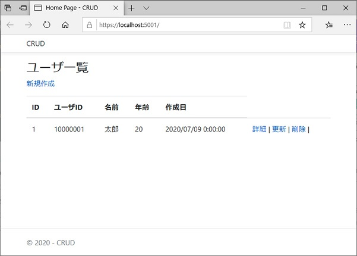
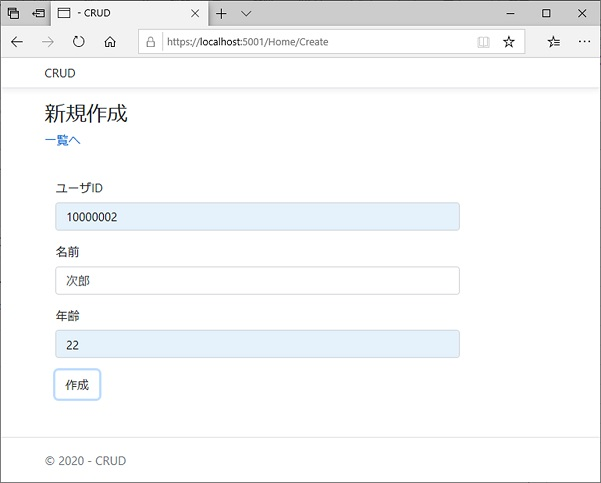
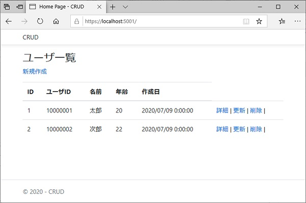
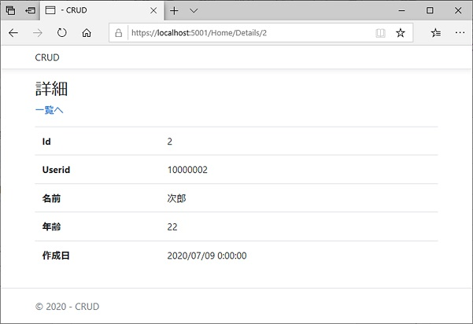
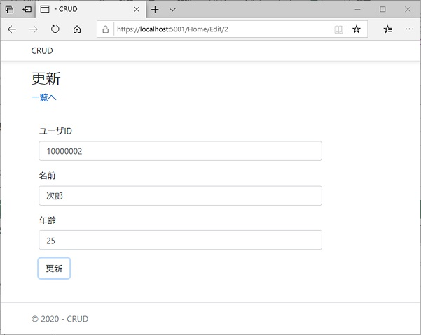
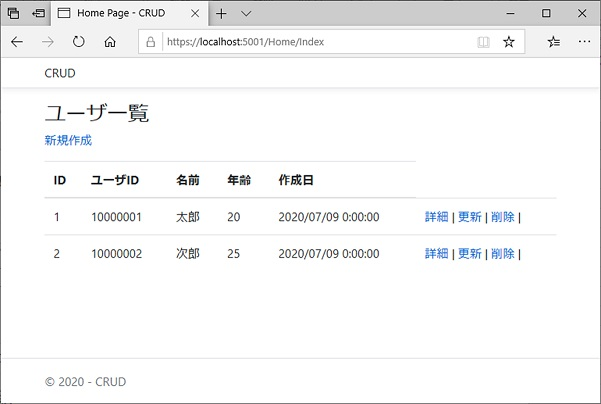
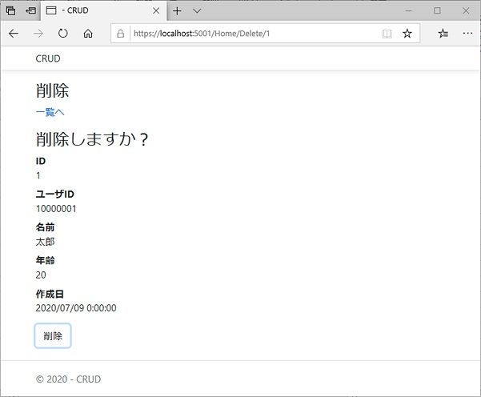
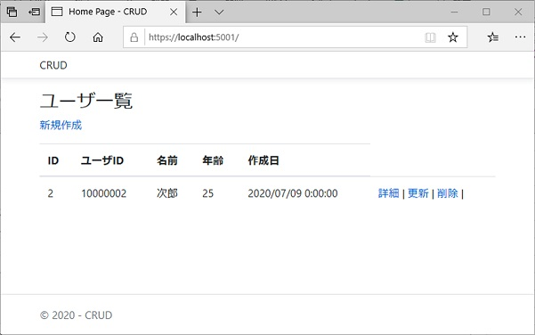

## ASP.NET Core でのCRUD実装

.NETアプリケーション上でデータのCRUD(登録・表示・更新・削除）を実装する方法について検証する。

## 検証方法

実際にCRUD機能を実装したアプリケーションを作成し検証を行う。  
- コードエディタはVisual Studio Code(VSCode)を使用  
- アプリケーションの種類はASP.NET MVCを選択  
- 外部のサーバ環境・DBとの接続は行わない  

## 開発環境

- .NET Core SDK 3.1  
  .NET Coreでの開発を行うのに必要

- Visual Studio Code  
    コードエディタ  
    VSCode上で下記を追加で導入する(Visual Studioの場合は不要)  
    - Entity Framework Core 3.x  
      データアクセスを行うためのフレームワーク  
      ターミナルで下記コマンドを実行して導入  
      `dotnet tool install --global dotnet-ef`

    - C# for Visual Studio Code  
      C#の開発を行う際に使用する拡張機能 
      拡張機能追加(Ctrl+Shift+x)から検索して導入 


## アプリケーション作成

1. プロジェクトの作成  
    プロジェクトフォルダ "CRUD" 作成後、右クリックから Code で開くを実行  
    開いたVSCodeのターミナルで下記コマンドを実行してmvcでプロジェクトを作成  
    `dotnet new mvc`  

    ターミナルで下記コマンドを実行してパッケージを追加  
    Entity Framework Core SQLite  
    `dotnet add package Microsoft.EntityFrameworkCore.SQLite`  
    Entity Framework Core Design  
    `dotnet add package Microsoft.EntityFrameworkCore.Design`  
    
    "ビルドとデバッグに必要な資産がプロジェクト内にありません。追加しますか？"  
    という内容のダイアログが表示された場合は Yes を選択  

1. モデルの追加  
    下記のモデルを追加  
    エンティティとデータベースコンテキストクラスで構成され、  
    Entity Framework Core でこれらのクラスを使用して、データベースを操作する  
    CRUD\Models\UserListModel.cs  
    ```C#
    using System;
    using System.ComponentModel.DataAnnotations;
    using Microsoft.EntityFrameworkCore;

    namespace CRUD.Models
    {
        //エンティティクラス
        public class UserListModel
        {
            public int Id { get; set; } //主キー
            public int Userid { get; set; }
            public string Name { get; set; }
            public int Age { get; set; }
            [DataType(DataType.Date)]
            public DateTime D_CRT {get; set;}
        }

        //データベースコンテキストクラス
        public class MvcCRUDContext : DbContext
        {
            public MvcCRUDContext (DbContextOptions<MvcCRUDContext> options)
                : base(options)
            {
            }
            public DbSet<UserListModel> CRUDTest { get; set; }
        }
    }
    ```
    モデル追加後は内容を適用するため一度ビルドを実行する。  


1. データベースコンテキストの登録  
    Startup.cs にデータベースコンテキストを登録  
    CRUD\Startup.cs  
    Startup.cs 先頭にUsingを追加  
    ```C#
    using CRUD.Models;
    using Microsoft.EntityFrameworkCore;
    ```  
    Startup.cs 内の ConfigureServices を下記に編集
    ```C#
    public void ConfigureServices(IServiceCollection services)
    {
        services.AddControllersWithViews();
        
        services.AddDbContext<MvcCRUDContext>(options =>
            options.UseSqlite(Configuration.GetConnectionString("MvcCRUDContext")));
    }
    ```

1. 接続文字列の追加  
    appsettings.json にModelで定義したDBの接続文字列を追加  
    CRUD\appsettings.json  
    ```json
    "ConnectionStrings": {
        "MvcCRUDContext": "Data Source=CRUDTest.db"
    }
    ```

1. マイグレーションの作成と実行  
    下記コマンドを実行してマイグレーションの作成と実行を行う  
    CRUD\Migration\\[タイムスタンプ]_InitialCreate.cs を生成  
    `dotnet ef migrations add InitialCreate`  
    生成したマイグレーションを実行し、CRUD\CRUDTest.db を生成  
    `dotnet ef database update`

1. コントローラの作成  
    HomeController.csの内容を下記に修正  
    CRUD各機能の画面表示時データ取得やデータ操作時アクションを定義する。  
    .\Controllers\HomeController.cs
    ```C#
    using System.Threading.Tasks;
    using Microsoft.AspNetCore.Mvc;
    using Microsoft.EntityFrameworkCore;
    using CRUD.Models;

    namespace CRUD.Controllers
    {
        public class HomeController : Controller
        {
            private readonly MvcCRUDContext _context;

            public HomeController(MvcCRUDContext context)
            {
                _context = context;
            }

            // 一覧ページ表示時
            public async Task<IActionResult> Index()
            {
                //データの一覧を取得
                //データ取得や更新は非同期で処理する
                return View(await _context.CRUDTest.ToListAsync());
            }

            // 詳細ページ表示時
            public async Task<IActionResult> Details(int? id)
            {
                //ページ遷移時に渡されるid=nullの場合のエラー処理
                if (id == null)
                {
                    return NotFound();
                }

                //idが一致するレコードを取得
                var userListModel = await _context.CRUDTest.FirstOrDefaultAsync(m => m.Id == id);

                //検索結果nullの場合のエラー処理
                if (userListModel == null)
                {
                    return NotFound();
                }

                return View(userListModel);
            }

            // 新規作成ページ表示時
            public IActionResult Create()
            {
                return View();
            }

            // 新規作成時アクション
            [HttpPost]
            [ValidateAntiForgeryToken] //CSRF防止用のtokenのチェック
            public async Task<IActionResult> Create([Bind("Id,Userid,Name,Age,D_CRT")] UserListModel userListModel)
            {
                //POSTされた時、値を受け取ってDBに登録
                if (ModelState.IsValid)
                {
                    //登録処理
                    _context.Add(userListModel);
                    await _context.SaveChangesAsync();
                    //登録成功時、一覧を表示
                    return RedirectToAction(nameof(Index));
                }
                //問題があった場合は元ページを表示
                return View(userListModel);
            }


            // 更新ページ表示時
            public async Task<IActionResult> Edit(int? id)
            {
                if (id == null)
                {
                    return NotFound();
                }

                var userListModel = await _context.CRUDTest.FirstOrDefaultAsync(m => m.Id == id);

                if (userListModel == null)
                {
                    return NotFound();
                }
                return View(userListModel);
            }

            // 更新時アクション
            [HttpPost]
            [ValidateAntiForgeryToken]
            public async Task<IActionResult> Edit(int id, [Bind("Id,Userid,Name,Age,D_CRT")] UserListModel userListModel)
            {
                if (ModelState.IsValid)
                {
                    //更新処理
                    _context.Entry(userListModel).State = EntityState.Modified;
                    await _context.SaveChangesAsync();
                    return RedirectToAction(nameof(Index));
                }
                return View(userListModel);
            }

            // 削除ページ表示時
            public async Task<IActionResult> Delete(int? id)
            {
                if (id == null)
                {
                    return NotFound();
                }

                var userListModel = await _context.CRUDTest.FirstOrDefaultAsync(m => m.Id == id);

                if (userListModel == null)
                {
                    return NotFound();
                }
                return View(userListModel);
            }

            //削除時アクション
            [HttpPost, ActionName("Delete")]
            [ValidateAntiForgeryToken]
            public async Task<IActionResult> DeleteConfirmed(int id)
            {
                //削除対象を取得・削除・保存
                var userListModel = await _context.CRUDTest.FindAsync(id);
                _context.CRUDTest.Remove(userListModel);
                await _context.SaveChangesAsync();
                return RedirectToAction(nameof(Index));
            }
        }
    }
    ```

1. ビューの追加  
    CRUDの各機能を構成する画面を追加  

    一覧  
    初期表示画面。ここからCRUD各処理を実行する画面を呼び出す。  
    詳細、更新、削除への画面遷移時に選択したレコードのIdの値を渡しており、  
    各画面はIdから対象レコードを特定して画面に表示する。  
    .\Views\HOME\Index.cshtml
    ```HTML
    @model IEnumerable<CRUD.Models.UserListModel>

    @{
        ViewData["Title"] = "Home Page";
    }

    <h3>ユーザ一覧</h3>

    <p><a href="/Home/Create">新規作成</a></p>

    <table class="table">
        <thead>
            <tr>
                <th>ID</th>
                <th>ユーザID</th>
                <th>名前</th>
                <th>年齢</th>
                <th>作成日</th>
            </tr>
        </thead>
        <tbody>
            @foreach (var item in Model)
            {
            <tr>
                <td>@item.Id</td>
                <td>@item.Userid</td>
                <td>@item.Name</td>
                <td>@item.Age</td>
                <td>@item.D_CRT</td>
                <td>
                    <a href="/Home/Details/@item.Id">詳細</a> | 
                    <a href="/Home/Edit/@item.Id">更新</a> | 
                    <a href="/Home/Delete/@item.Id">削除</a> | 
                </td>
            </tr>
            }
        </tbody>
    </table>
    ```

    詳細  
    一覧画面から受け取ったIdと一致するレコードを表示  
    .\Views\HOME\Details.cshtml  
    ```HTML
    @model CRUD.Models.UserListModel
    @{
        Layout = "~/Views/Shared/_Layout.cshtml";
    }

    <h3>詳細</h3>
    <p><a href="/Home/Index">一覧へ</a></p>

    <table class="table">
        <tr>
            <th>Id</th>
            <td>@Model.Id</td>
        </tr>
        <tr>
            <th>Userid</th>
            <td>@Model.Userid</td>
        </tr>
        <tr>
            <th>名前</th>
            <td>@Model.Name</td>
        </tr>
        <tr>
            <th>年齢</th>
            <td>@Model.Age</td>
        </tr>
        <tr>
            <th>作成日</th>
            <td>@Model.D_CRT</td>
        </tr>
    </table>
    ```

    新規作成  
    レコードの新規作成を行う  
    Idは主キーとしてレコード作成時に自動採番させる。  
    また、D_CRTはマシン日付を自動設定しているため、入力フォームは Userid,Name,Age の3つを設定。  
    .\Views\HOME\Create.cshtml  
    ```HTML
    @model CRUD.Models.UserListModel
    @{
        Layout = "~/Views/Shared/_Layout.cshtml";
    }

    <h3>新規作成</h3>
    <p><a href="/Home/Index">一覧へ</a></p>
    <form action="/Home/Create" method="post">

    　　<!-- csrf対策用のtokenを送付 -->
        @Html.AntiForgeryToken()

        <div class="form-horizontal">
            <!-- Userid -->
            <div class="form-group">
                <label class="control-label col-md-2">ユーザID</label>
                <div class="col-md-10">
                    <input type="text" name="Userid" class="form-control" />
                    @Html.ValidationMessageFor(model => model.Userid, "", new { @class = "text-danger" })
                </div>
            </div>
            <!-- Name -->
            <div class="form-group">
                <label class="control-label col-md-2">名前</label>
                <div class="col-md-10">
                    <input type="text" name="name" class="form-control" />
                    @Html.ValidationMessageFor(model => model.Name, "", new { @class = "text-danger" })
                </div>
            </div>
            <!-- Age -->
            <div class="form-group">
                <label class="control-label col-md-2">年齢</label>
                <div class="col-md-10">
                    <input type="text" name="age" class="form-control" />
                    @Html.ValidationMessageFor(model => model.Age, "", new { @class = "text-danger" })
                </div>
            </div>
            <!-- D_CRT -->
            <input type="hidden" name="D_CRT" value=@DateTime.Now/>
            <!-- 送信ボタン -->
            <div class="form-group">
                <div class="col-md-offset-2 col-md-10">
                    <input type="submit" value="作成" class="btn btn-default" />
                </div>
            </div>    
        </div>
    </form>
    ```

    更新  
    既存レコードの編集を行う  
    主キーであるIdと、作成日自動設定のD_CRTはhiddenで非表示にして送信する。  
    .\Views\HOME\Edit.cshtml  
    ```HTML
    @model CRUD.Models.UserListModel
    @{
        Layout = "~/Views/Shared/_Layout.cshtml";
    }

    <h3>更新</h3>
    <p><a href="/Home/Index">一覧へ</a></p>
    <form action="/Home/Edit" method="post">

    　　<!-- csrf対策用のtokenを送付 -->
        @Html.AntiForgeryToken()

        <div class="form-horizontal">
            <!-- id -->
            <input type="hidden" name="id" value="@Model.Id"/>
            <!-- Userid -->
            <div class="form-group">
                <label class="control-label col-md-2">ユーザID</label>
                <div class="col-md-10">
                    <!--既存値を初期表示-->
                    <input type="text" name="Userid" class="form-control" value="@Model.Userid"/> 
                    @Html.ValidationMessageFor(model => model.Userid, "", new { @class = "text-danger" })
                </div>
            </div>
            <!-- Name -->
            <div class="form-group">
                <label class="control-label col-md-2">名前</label>
                <div class="col-md-10">
                    <input type="text" name="name" class="form-control" value="@Model.Name"/>
                    @Html.ValidationMessageFor(model => model.Name, "", new { @class = "text-danger" })
                </div>
            </div>
            <!-- Age -->
            <div class="form-group">
                <label class="control-label col-md-2">年齢</label>
                <div class="col-md-10">
                    <input type="text" name="age" class="form-control" value="@Model.Age"/>
                    @Html.ValidationMessageFor(model => model.Age, "", new { @class = "text-danger" })
                </div>
            </div>
            <!-- D_CRT -->
            <input type="hidden" name="D_CRT" value="@Model.D_CRT"/>
            <!-- submit -->
            <div class="form-group">
                <div class="col-md-offset-2 col-md-10">
                    <input type="submit" value="更新" class="btn btn-default" />
                </div>
            </div>
        </div>
    </form>
    ```

    削除  
    レコードの削除を行う  
    .\Views\HOME\Delete.cshtml  
    ```HTML
    @model CRUD.Models.UserListModel
    @{
        Layout = "~/Views/Shared/_Layout.cshtml";
    }

    <h3>削除</h3>
    <p><a href="/Home/Index">一覧へ</a></p>
    <h3>削除しますか？</h3>

    <dl class="dl-horizontal">
        <dt>ID</dt>
        <dd>@Model.Id</dd>

        <dt>ユーザID</dt>
        <dd>@Model.Userid</dd>

        <dt>名前</dt>
        <dd>@Model.Name</dd>

        <dt>年齢</dt>
        <dd>@Model.Age</dd>

        <dt>作成日</dt>
        <dd>@Model.D_CRT</dd>
    </dl>

    <form action="/Home/Delete" method="post">
        @Html.AntiForgeryToken()
        <div class="form-actions no-color">
            <input type="hidden" name="id" value="@Model.Id" />
            <input type="submit" value="削除" class="btn btn-default" />
        </div>
    </form>
    ```

## 検証結果

一覧画面でレコードを全件取得して表示  
表示されているのはあらかじめ登録しておいた一件のみ  


新規作成でレコードを追加  
IDと作成日の値は自動でセットされるため入力欄無し  
　ID：既存レコードのIDの最大値+1を設定  
　作成日：マシン日付を取得して設定  


新規作成したレコードが正常に追加され、一覧画面にも表示されるていることを確認  
IDと作成日の値も自動でセットされている  


次郎の"詳細"をクリック  
詳細画面で新規作成したレコードが表示されることを確認  
URLの末尾で主キー(Id)の値：2 が渡されており、この値をもとにレコードを参照  


次郎の"更新"をクリック  
更新画面でレコードを編集して更新  
年齢を 22⇒25 に更新  


更新内容が反映され、一覧画面の内容も更新されることを確認  


一郎の"削除"をクリック  
削除画面で一郎のレコードを削除  


レコードの削除が反映され、一覧画面らも消えることを確認  


## 備考

- 主キーと自動採番について
    エンティティに"Id"を設定している場合、  
    マイグレーション作成時に自動で主キーの登録と自動採番の設定が行われる。  
    主キーを任意の項目にしたり自動採番を行わない場合は下記のアノテーションを追加する。
    model.cs
    ```C#
    using System.ComponentModel.DataAnnotations.Schema;
    ~~~~~~~
        [Key] //主キーとして設定される
        [DatabaseGenerated(DatabaseGeneratedOption.None)] //自動採番を行わないようにする
        public int Userid { get; set; }
    ~~~~~~~
    ```

- 対象レコードの取得方法について  
    レコードの取得は今回使った.FirstOrDefault の他に  
    .Farst や .Find があるが、下記特徴のため .FirstOrDefault を選択  
    - .Farst：一致するデータがないとExceptionが発生するので注意が必要  
    - .Find：Listが持っているメンバメソッドのため、List以外では使えない  
    - .FirstOrDefault：IEnumerableに（拡張メソッドとして）実装されているのでどんなリストの型でも使える  


# 参考文献
- [ASP.NET Core MVC で Web アプリを作成する](https://docs.microsoft.com/ja-jp/aspnet/core/tutorials/first-mvc-app/?view=aspnetcore-3.1)
- [ASP.NET MVC でCRUD](https://qiita.com/zaburo/items/610bd34df3c819c67551)
- [Entity Framework - Entity Frameworkを使い始める | entity-framework Tutorial](https://riptutorial.com/ja/entity-framework)
- [【C#】コードファーストで DB に 初期データ入れる - Qiita](https://qiita.com/Nossa/items/d48fbe91ca470748a3d7)